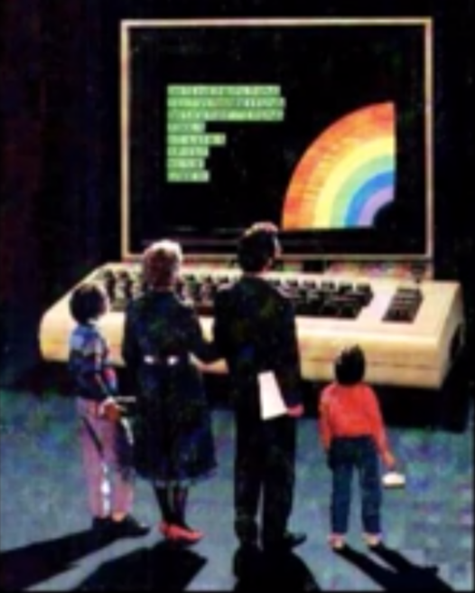

## About

RL@QMUL

## Research Interest

Decision making and the action-perception loop with a specific interest in sparse rewards problems, macro-actions, multi-agent RL and the combinational action problem.

## Reading Group

Welcome to the *Reinforcement Learning reading group* at **Queen Mary University of London**.

Date | Paper | Presenter
-----|-------|--------
09 October 2019 | [Deep Exploration via Bootstrapped DQN](https://arxiv.org/abs/1602.04621) - Osband et al. (2016) | Ercüment İlhan
28 August 2019 | [Learning Latent Dynamics for Planning from Pixels](https://arxiv.org/abs/1811.04551) - Hafner et al. (2018) | Alvaro Ovalle
16 August 2019 | [Shaping belief states with generative environment models for RL](https://arxiv.org/abs/1906.09237) - Gregor et al. (2019) | Chris Bamford
4 July 2019 | [Learning to act by predicting the future](https://arxiv.org/abs/1611.01779) - Dosovitskiy & Koltun (2016) | Martin Balla
27 June 2019 | [Imitating latent policies from observation](https://arxiv.org/abs/1805.07914) - Edwards et al. (2018) | Ercüment İlhan
1 May 2019 | [World Discovery Models](https://arxiv.org/abs/1902.07685) - Azar et al. (2019) | Alvaro Ovalle
17 April 2019 | [Provably efficient RL with Rich Observations via Latent State Decoding](https://arxiv.org/abs/1901.09018) - Du et al. (2019) | Chris Bamford
10 April 2019 | [Distilling Policy Distillation](https://arxiv.org/abs/1902.02186) - Czarnecki et al. (2019) | Martin Balla
3 April 2019 | [Deep Reinforcement Learning that Matter](https://arxiv.org/abs/1709.06560) - Henderson et al. (2017) | Ercüment İlhan
21 March 2019 | [Intrinsic Motivation and Automatic Curricula via Asymmetric Self-Play](https://arxiv.org/abs/1703.05407) - Sukhbaatar et al. (2017) | Alvaro Ovalle
6 March 2019 | [Deep reinforcement learning with relational inductive biases](https://openreview.net/forum?id=HkxaFoC9KQ) - Zambaldi et al. (2018) | Martin Balla
28 Feb 2019 | [Show, Attend and Tell: Neural Image Caption Generation with Visual Attention](https://arxiv.org/abs/1502.03044) - Xu et al. (2015) | Chris Bamford
13 Feb 2019 | [Universal Value Function Approximators](http://proceedings.mlr.press/v37/schaul15.pdf) - Schaul et al. (2015)| Ercüment İlhan
6 Feb 2019 | [Temporal Difference Variational Auto-Encoder](https://arxiv.org/abs/1806.03107) - Gregor et al. (2018) | Alvaro Ovalle & Chris Bamford
6 Feb 2019 | [An investigation of model-free planning](https://arxiv.org/abs/1901.03559) - Guez et al. (2019) | Alvaro Ovalle
30 Jan 2019 | [Hindsight Experience Replay](https://arxiv.org/abs/1707.01495) - Andrychowicz et al. (2017) | Alvaro Ovalle
24 Jan 2019 | [Strategic Attentive Writer for Learning Macro-Actions](https://arxiv.org/abs/1606.04695) - Vezhnevets et al. (2016) | Martin Balla
16 Jan 2019 | [Imagination-Augmented Agents for Deep Reinforcement Learning](https://arxiv.org/abs/1707.06203) - Weber et al. (2017) | Chris Bamford
12 Dec 2018 | [Machine Theory of Mind](https://arxiv.org/abs/1802.07740) - Rabinowitz et al. (2018) | Ercüment İlhan
15 Nov 2018 | [Exploration by Random Network Distillation](https://arxiv.org/abs/1810.12894) - Burda et al. (2018) | Alvaro Ovalle

---

> The end is nigh

